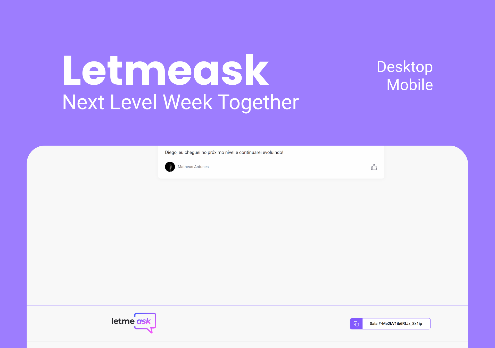

<p align="center">
  
</p>

<h1 align="center">
    
</h1>

<br>

## 🤯🤯 Meu depoimento!

Quero agradecer a RocketSeat por trazer um projeto relevante e com tecnologias tão atuais. Sou um publicitário fazendo meu caminho para a programação e poder ter um conteúdo gratuito nesse nível é demais! 
<br>
<br>
Até agora, além do que fizemos nas aulas com o Diego, apliquei alguns assets que estavam faltando na spec do Figma e fiz uma adaptação responsiva baseando-se no meu conhecimento de UI.
<br>
<br>
Os próximos passos são:
  - Styled Components;
  - Tema Dark/Light;
  - Tudo que vier na minha cabeça (o negócio é sempre correr atrás do próximo nível!)
<br>
----------------------

## 🧪 Tecnologias

Esse projeto foi desenvolvido com as seguintes tecnologias:

- [React](https://reactjs.org)
- [Firebase](https://firebase.google.com/)
- [TypeScript](https://www.typescriptlang.org/)

## 🚀 Como executar

Para iniciá-lo, siga os passos abaixo:
```bash
# Instalar as dependências
$ yarn

# Iniciar o projeto
$ yarn start
```
O app estará disponível no seu browser pelo endereço http://localhost:3000.

Lembrando que será necessário criar uma conta no [Firebase](https://firebase.google.com/) e um projeto para disponibilizar um Realtime Database.

## 💻 Projeto

Letmeask é perfeito para criadores de conteúdos poderem criar salas de Q&A com o seu público, de uma forma muito organizada e democrática. 

Este é um projeto desenvolvido durante a **[Next Level Week Together](https://nextlevelweek.com/)**, apresentada dos dias 20 a 27 de Junho de 2021.


## 🔖 Layout

Você pode visualizar o layout do projeto através do link abaixo:

- [Layout Web](https://www.figma.com/file/u0BQK8rCf2KgzcukdRRCWh/Letmeask/duplicate) 

Lembrando que você precisa ter uma conta no [Figma](http://figma.com/).

## 📝 License

Esse projeto está sob a licença MIT. Veja o arquivo [LICENSE](LICENSE.md) para mais detalhes.

---

Feito com 💜 by Rocketseat 👋🏻 [Participe da comunidade](https://discord.gg/gKUVrzrPrU)
